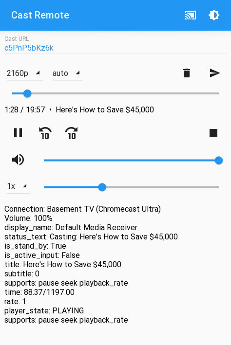

# Cast Remote

Watch Youtube in 4K on Chromecast without ads and with playback rate control.

Written in Python with [Kivy](https://kivy.org/) and [KivyMD](https://github.com/kivymd/KivyMD).

Mostly works, but looks like it shouldn't. KivyMD probably needs some work (admittedly it is still alpha); it seems quite buggy right now.
A native Android rewrite is probably a good idea, but unlikely to happen any time soon.

## Usage

UI elements from top to bottom:
- Select a Chromecast using the "cast" button.
- Dark/Light does not yet work properly. It works with KivyMD master, but that has more issues on Android.
- URL for casting. Using [youtube-dl](https://youtube-dl.org/), but not only youtube is supported. On Android URLs can also be received using the "share" functionality.
- Select maximum resolution and format.
- Clear the URL field and start casting.
- Select playback rate from 0.5x to 2x. Note that 2x does not work fluidly on all resolutions.
- Status information.

## Technical Notes

Youtube only provides separate audio and video streams for resolutions above 4k.
Chromecast allows the specification of multiple tracks, which the Chromecast cannot actually handle with the default receiver (https://developers.google.com/cast/docs/chrome_sender/advanced): 

> Note: Currently, the Styled and Default Media Receivers allow you to use only the text tracks with the API. To work with the audio and video tracks, you must develop a Custom Web Receiver.

But it does support [Dynamic Adaptive Streaming over HTTP (DASH)](https://en.wikipedia.org/wiki/Dynamic_Adaptive_Streaming_over_HTTP), which allow the specification of multiple audio and video tracks.
The Chromecast can even switch between these depending on the available network speed.

So this app builds a DASH file and then becomes a webserver to send the DASH file to the Chromecast.
To do that, the app needs to download the beginning of each network stream to figure out the index of some special segment.
Chromecast loads the video from Javascript and therefore a CORS proxy is needed.

## Build and Run

First, a CORS proxy needs to be setup.
I used [CORS Anywhere](https://github.com/Rob--W/cors-anywhere).
It can be set up in the local network or a remote server.
If you know how, it is also quite easy to find public instances that probably should not be public ...

### PC

Install the requirements.txt using pip.

### Android

Setup [buildozer](https://buildozer.readthedocs.io/en/latest/).
Run `buildozer android debug` to get an unsinged debug APK.
The release APK needs to be signed, for which a `sign.sh` script is provided (configure SDK path).
